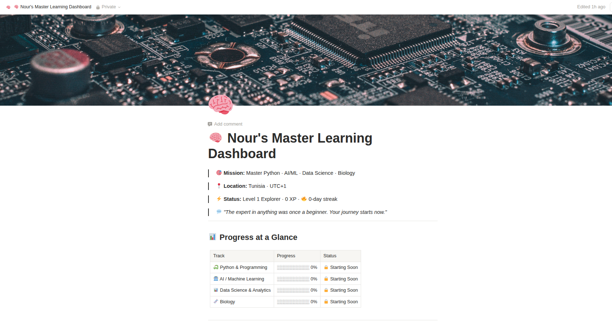

# 🧠 notion-claude-learning-hub

**Claude Learning Companion v4**

A warm, intelligent, science-backed **Personal Learning Companion** that turns Notion into a **beautiful, elegant, and highly motivating learning hub** — complete with smart Google Calendar automation.

**Powered by Genoflow** ❤️

---

## ✨ Why You'll Love This

Learning alone can feel overwhelming and scattered.

This skill changes that.

It creates a calm, premium aesthetic dashboard layered with powerful RPG gamification — so every day feels purposeful and rewarding.

You get:
- Beautiful, motivating design that inspires you to open it
- Full RPG system: Levels, XP, daily streaks, 12 inspiring badges, and a stunning Wall of Wins
- Smart Google Calendar automation with popup reminders
- A clear personalized roadmap and daily missions
- A dedicated AI companion that celebrates your progress with genuine warmth

The result? Consistent progress without the burnout.

---

## 🚀 How to Get Started (5 Minutes)

1. In Notion, open or create a clean page and rename it to **"Master Learning Dashboard"**.

2. Open the [`SKILL.md`](SKILL.md) file in this repository.

3. Copy the **entire content**.

4. Start a new chat with Claude.

5. Paste everything and type exactly this:

   > `Activate this skill and start my onboarding`

Claude will guide you step-by-step: building the elegant dashboard, adding the full gamification system, setting up Google Calendar, and launching your first mission with real encouragement.

---

## 📸 What Your Dashboard Will Look Like

  
  

*(Real example from Nour’s setup — Python, AI/ML, Data Science & Biology tracks)*

---

## ✨ v4 Highlights

- 🎨 Elegant premium aesthetic dashboard
- ⚔️ Complete RPG gamification (Levels, XP, Streaks, 12 Badges, Portfolio)
- 📅 Google Calendar automation (popup notifications only)
- 🛠 New Tools Discovered corner
- 🗓 Visual Learning Calendar as your Mission Board
- Fully generic — works for any learning goal

---

## 📁 What's Inside

- `SKILL.md` — The complete skill (copy & paste to activate)
- `QUICK_START.md` — One-page fast launch guide
- `references/` — XP system details + badge guide
- `screenshots/` — Real dashboard examples

---

**Ready to transform your learning journey?**

Open [`SKILL.md`](SKILL.md), activate the skill, and let Claude become your personal Learning Companion.

**Built with ❤️ for curious minds who want beautiful structure and real progress.**

---

⭐ If this inspires you, star the repo!
